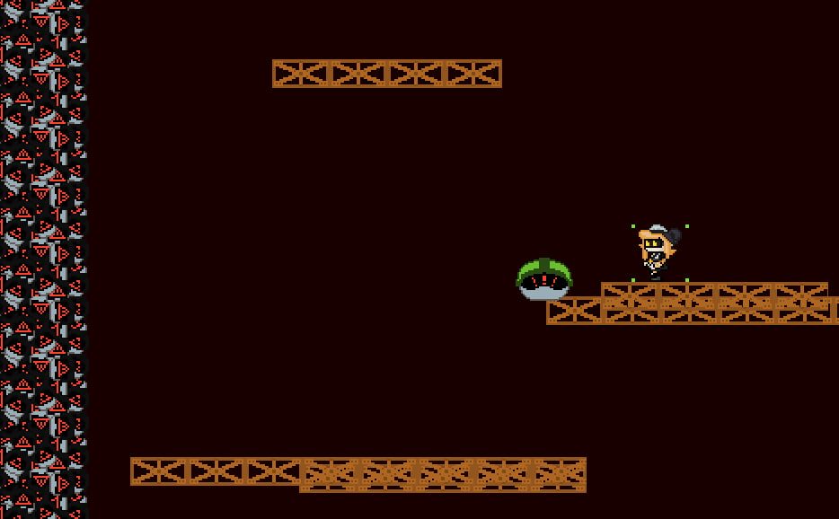

# The PIT: Ascension 🌋

A vertical platformer with improved physics, adaptive artificial intelligence and a multi-stage passing system. A fast-paced procedural vertical 2D platformer ported to **Godot 4**. 

Ascend through the treacherous PIT! You start at the very bottom (Depth 8000) and must climb your way to the surface. Beware of falling golems, bouncing slimes, and relentless pursuers. Unlock new abilities as you ascend higher and higher!



## 🌟 Features

- **Procedural Level Generation**: Platform layouts and enemy spawns adapt to your depth dynamically.
- **Dynamic Entities**: Moving platforms (horizontal and vertical), trampolines, and dangerous enemies.
- **Upgrade System**: Reach specific milestones to unlock Double Jump and Sideways Strike.
- **Godot 4 Powered**: Smooth 60FPS physics, crisp 1080p pixel-art scaling, and a robust component system.
- **Responsive Controls**: Includes coyote time, strike combo cooldowns, and precise platforming logic.

## 🎮 Controls

| Action | Key(s) |
| :--- | :--- |
| **Move Left/Right** | `Left/Right Arrows`, `A / D` |
| **Jump** | `Up Arrow`, `W`, `Space` |
| **Dash Down** | `Down Arrow`, `S` |
| **Strike (Attack)** | `Z`, `J` |
| **Toggle Flight (Cheat)** | `F` |
| **Reset Game** | `R` |
| **Pause** | `ESC` |

## 🛠️ Installation & Running

1. **Clone this repository**
   ```bash
   git clone https://github.com/AnatomikPerq/ThePit-Ascension.git
   ```
2. Open **Godot Engine** (v4.3 or compatible 4.x version).
3. Click **Import** and select the `project.godot` file in this folder.
4. Press `F5` to run the game!

## 📜 Project Structure

* `scenes/` - Contains all reusable Godot scenes (`Player`, `World`, `Enemies`, `Platforms`).
* `scripts/` - GDScript logic powering the entities and procedural generation.
* `assets/sprites/` - Original raw 32x32 sprite textures, automatically upscaled cleanly in-engine.

---
*Created as a Python to Godot 4 porting project.*
