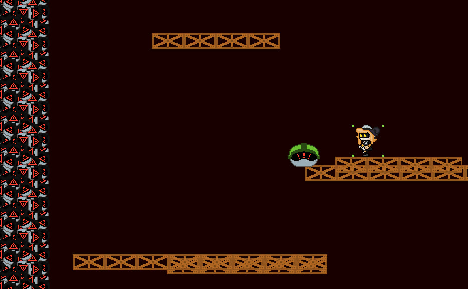

# The PIT: Ascension 🌋

A fast-paced procedural vertical 2D platformer for **Godot 4.7**, played solo
or over the network. You are Cyn, a broken drone at the bottom of a trash pit
— depth 8000. The Absolute Solver is active. Climb out.

A fan project inspired by *Murder Drones* (GLITCH), episode 5. Open source,
non-commercial. See [docs/CONTENT.md](docs/CONTENT.md) for the theme and the
full content inventory.



## Features

- **Seeded procedural generation** — the whole pit is a deterministic
  function of one seed: platform rows, moving platforms, walls, level
  dividers. Same seed, same world, on every machine.
- **Five enemies** — Golem (petrifies into a platform when killed), Slime
  (leaves a trampoline), Pursuer, Bat, Spitter. One shared combat component;
  each enemy's numbers live in a resource, not in code.
- **Upgrades** — milestones at 75/50/25% depth offer Double Jump, Sideways
  Strike, Shockwave Blast, or +1 Max HP with a full heal.
- **Score & combos** — chained kills within 3 s multiply the reward. Best
  score persists between sessions.
- **Multiplayer** — one player hosts on an open port, the rest join by
  address. **Co-op** (first to the surface wins for the team) or **race**
  (exactly one winner). No accounts, no services, plain ENet.
  See [docs/NETWORKING.md](docs/NETWORKING.md).
- **Juice** — screen shake, squash & stretch, dash ghost trails, particle
  bursts, floating score popups; ember-lit backdrop shifting from molten
  depths to pre-dawn sky as you ascend.

## Controls

| Action | Key(s) |
| :--- | :--- |
| Move left / right | `A` / `D`, `←` / `→` |
| Jump | `Space`, `W` |
| Dash down | `S`, `↓` |
| Strike (when unlocked) | `Z`, `LMB` |
| Shockwave (when unlocked) | `C` |
| Upgrade menu picks | `Z / X / C / V` |
| Pause / back | `ESC` |
| Restart (solo) | `R` |
| Music on/off | `M` |
| Debug hitboxes | `U` |
| Flight (cheat) | `F` |

Movement keys are bound to physical positions (WASD works on any keyboard
layout); menu keys are bound to the letters printed on screen.

## Running

1. Clone the repository:
   ```bash
   git clone https://github.com/AnatomikPerq/ThePit-Ascension.git
   ```
2. Open **Godot 4.7** (or a compatible 4.x), import `project.godot`, press `F5`.

### Multiplayer quickstart

1. The host opens (forwards) a UDP port — default **24565** — and clicks
   **MULTIPLAYER → HOST**.
2. Everyone else enters the host's address and port and clicks **JOIN**.
3. The host picks **CO-OP** or **RACE** and starts the climb. The roster
   locks at that moment; there is no join-in-progress.

Single-player never opens a socket.

## Project structure

```
src/       code by system (audio/, core/, entities/, world/, ui/, net/, fx/, defs/)
scripts/   entity controllers and the older autoloads
data/      .tres resources — the tuning surface (audio/, animations/, enemies/, fx/, worlds/)
scenes/    .tscn by category (fx/, ui/, entities at the top level)
assets/    sprites/, audio/ (+ CREDITS.md), ui/
tools/     headless probes, one-shot generators, the test harness
docs/      ARCHITECTURE, CONTENT, NETWORKING, TESTING
test/      GdUnit4 suites
```

## Verifying a change

```bash
bash tools/run_tests.sh
```

runs everything headless: the GdUnit4 suites, a 50-check smoke test, an
input/state probe, the world-generation fingerprint, a two-instance
multiplayer probe over a localhost socket, and the convention gates.
See [docs/TESTING.md](docs/TESTING.md).

## Credits

All audio is CC0 (Kenney + OpenGameArt) — see
[assets/audio/CREDITS.md](assets/audio/CREDITS.md). *Murder Drones* and its
characters belong to GLITCH; this is an unaffiliated, non-commercial fan work.

---
*Originally a Python-to-Godot port; since rebuilt around data-driven
resources, authored scenes and a host-authoritative network model.*
