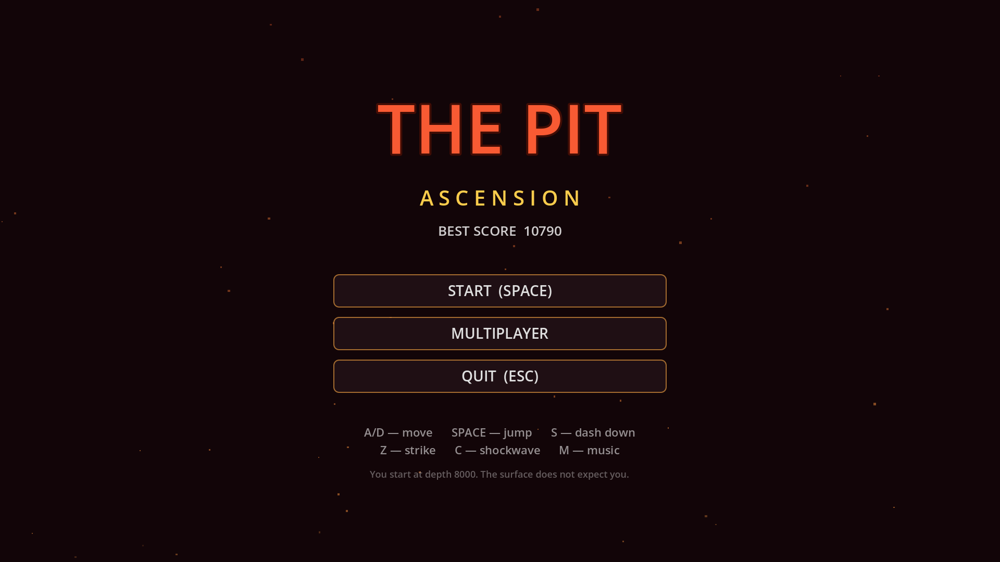
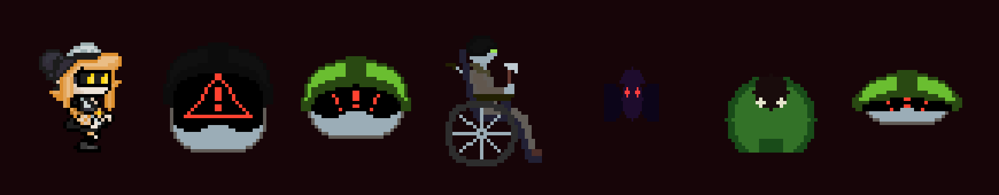
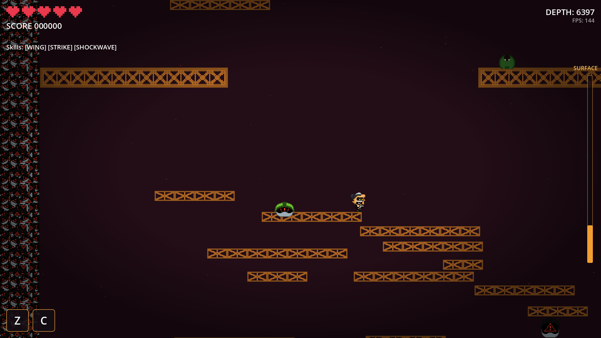
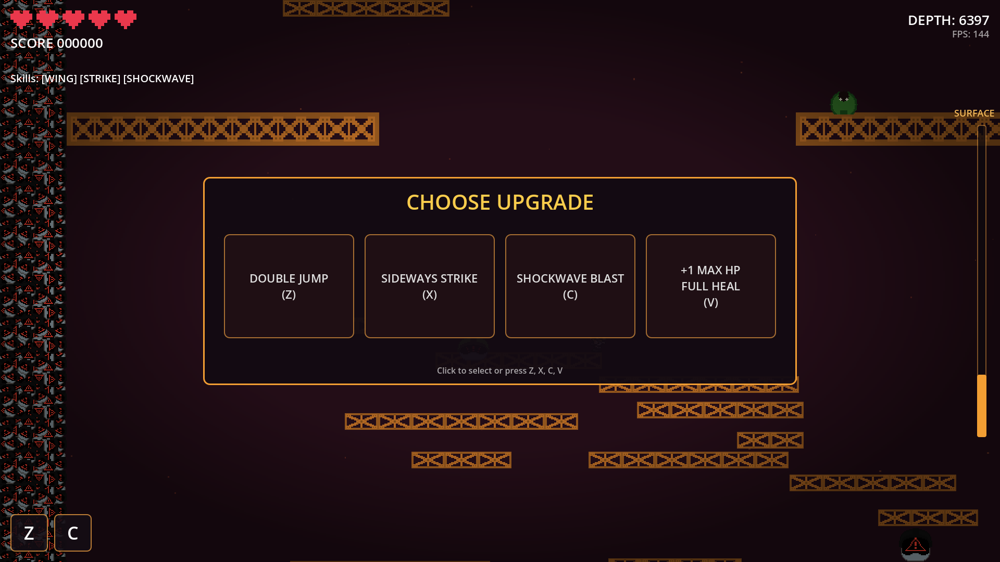
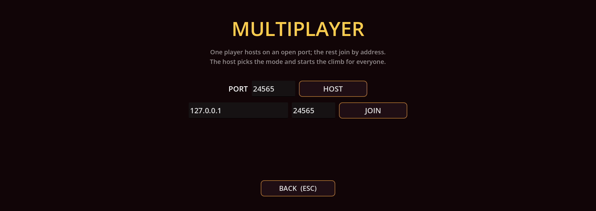

<div align="center">



**A seeded vertical platformer for Godot 4.7. You start at depth 8000.
The surface does not expect you.**

Solo · Co-op · Race — plain ENet, no accounts, no services.

</div>

---

You are **Cyn**, at the bottom of a trash pit where broken worker drones are
dumped. The Absolute Solver is active. Their heads are falling past you on the
way down. Climb out.

A fan project inspired by ***Murder Drones*** (GLITCH), episode 5. Open source,
non-commercial, unaffiliated. The theme and the full content inventory are in
[docs/CONTENT.md](docs/CONTENT.md).

## The cast



| | Who | What it does | How it dies | What it leaves |
| :-- | :--- | :--- | :--- | :--- |
| 1 | **Cyn** | you | falling, mostly | — |
| 2 | **Golem** | a broken drone head, falling straight down | any stomp, or a strike | a petrified platform |
| 3 | **Slime** | falls while drifting sideways | any stomp, or a strike | a trampoline |
| 4 | **Pursuer** | chases along the ground, jumps walls and gaps | any stomp, or a strike | — |
| 5 | **Bat** | flies at you with a sine wobble | any stomp, or a strike | — |
| 6 | **Spitter** | sits on a platform and lobs acid | **dash** stomp, or a strike | — |
| 7 | **Trampoline** | what a stomped slime becomes | — | altitude |
| 8 | **Bomb** | a head that was still live when it was dumped, falling past you | it does not die — it goes off | a hole in the pit |

A jump on the head kills anything except the **spitter**, which demands a dash
and costs you a heart if you land on it without one. A golem you turned into a
platform is a step; a slime you turned into a trampoline is a shortcut. The whole
point of the pit is that it is built out of the things that were trying to kill
you.

## The bomb

It falls a shade quicker than the rest, and it falls **through** the level —
platforms and walls are not there as far as it is concerned.

Hit it with a **Strike** or a **Shockwave** and it is not fired, it is *thrown* —
spinning, along the line away from wherever the swing came from, so a hit from
below sails it up and one from above drives it into the floor. Catch it right
against you and it goes about twice as far as one clipped by the outer edge of
the same ring. From that moment the first thing it touches ends it. That is the
whole mechanic: the hazard becomes a demolition charge you can aim.

Anything caught in the blast is thrown away from it, along both axes and harder
the closer it was — the shove reaches further than the damage does, so a bomb
going off nearby moves you even when it never got close enough to hurt you.

And do not walk into one. Setting a bomb off with your own body costs **two**
hearts, throws you across the shaft, and fills your screen with it. Nobody else
sees any of that — they get the ordinary blast, and watch you leave at speed.

Whatever the blast covers dies. Whatever it *outmuscles* breaks: the wave's force
falls off with distance, and every breakable thing in the pit has a strength it
is compared against. A platform is tougher than the platform a golem petrified
into, which is tougher than a slime's trampoline. Cracks do not accumulate — a
near miss is a near miss. The shaft itself, the floor and the level dividers
never break; everything else is fair game.

In a session the host decides what a blast destroyed and tells everyone *which
pieces*, by name — the pit is rebuilt from a seed on every machine, so the hole
has to be the same hole. Explosions are heard from where they happened and get
quieter the further away you are.

## The climb



Every pit is a deterministic function of one seed — platform rows, moving
platforms, walls, level dividers, enemy pacing. The same seed builds the same
world on every machine, which is what lets multiplayer send a number instead
of a level.

At 75%, 50% and 25% of the way up, the climb pays out:



Double Jump, Sideways Strike, Shockwave Blast — or +1 max HP with a full heal
if you would rather survive than show off. Chained kills within three seconds
multiply the score, and the best run persists between sessions.

## Multiplayer



One player forwards a UDP port (default **24565**) and hosts; everyone else
joins by address. The host picks the mode and starts the climb for all of them.

- **Co-op** — the first to the surface wins it for the team.
- **Race** — exactly one winner, and the other climbers are in your way for
  real: rivals are solid, so you can stand on a head, and Strike, Shockwave and
  dash-stomp all land on them.

The host can restart the run for everyone at any time. Anyone can leave for the
main menu at any time. **Single-player never opens a socket.**

Which parts of the game are simulated where — element by element, with the
rules the model stands on — is [docs/NETWORKING.md](docs/NETWORKING.md).

## Controls

| Action | Key(s) |
| :--- | :--- |
| Move left / right | `A` / `D`, `←` / `→` |
| Jump | `Space`, `W` |
| Dash down | `S`, `↓` |
| Strike (when unlocked) | `Z`, `LMB` |
| Shockwave (when unlocked) | `C` |
| Upgrade menu picks | `Z / X / C / V` |
| Pause / back | `ESC` |
| Restart | `R` (in a session, host only — restarts for everyone) |
| Music on/off | `M` |
| Debug hitboxes | `U` |
| Flight (cheat) | `F` |

Movement keys are bound to physical positions, so WASD works on any keyboard
layout; menu keys are bound to the letters printed on screen. Pausing offers
**RESUME / RESTART / MAIN MENU** as buttons, in every mode — a run can be left
whenever you like, not only after dying.

## Running it

```bash
git clone https://github.com/AnatomikPerq/ThePit-Ascension.git
```

Open **Godot 4.7** (or a compatible 4.x), import `project.godot`, press `F5`.

That is all you need to play it. If you also want to *work* on it — headless
tests, the linter, sprites round-tripping out of Aseprite — there is one more
command:

```bash
bash tools/setup_claude.sh
```

It is idempotent, it installs only what git cannot carry, and it tells you what
is missing instead of guessing. [godot-pixel-stack-setup.md](godot-pixel-stack-setup.md)
explains the whole toolchain and lists every environment variable that overrides
a path.

### Multiplayer quickstart

1. Host: forward the UDP port, then **MULTIPLAYER → HOST**.
2. Everyone else: enter the host's address and port, **JOIN**.
3. Host: pick **CO-OP** or **RACE** and start. The roster locks at that moment
   — there is no join-in-progress.

## How it is put together

```
src/       code by system (audio/, core/, entities/, world/, ui/, net/, fx/, defs/)
scripts/   entity controllers and the older autoloads
data/      .tres resources — the tuning surface (audio/, animations/, enemies/, fx/, worlds/)
scenes/    .tscn by category (fx/, ui/, entities at the top level)
assets/    sprites/, audio/ (+ CREDITS.md), ui/
tools/     headless probes, one-shot generators, the test harness, setup_claude.sh
docs/      ARCHITECTURE, CONTENT, NETWORKING, TESTING
test/      GdUnit4 suites
addons/    AsepriteWizard, gdUnit4, godot_mcp — committed with the project
```

Code defines behaviour; `.tres` files define numbers. If you are tuning
something, you should be in the inspector and not in a script — enemy stats,
world layout, spawn weights, particle shapes and every sound all live in
`data/`. Layout lives in scenes, not in `Label.new()`.

[docs/ARCHITECTURE.md](docs/ARCHITECTURE.md) names the seam for each thing the
project is meant to grow into next.

## Verifying a change

```bash
bash tools/run_tests.sh
```

Everything headless, one command: the GdUnit4 suites, a 55-check smoke test, an
input/state probe driving real key events, the world-generation fingerprint, a
two-instance multiplayer probe over a localhost socket — including a host
restart, a race hit landing across machines, and a bomb the host sets off taking
the same platform out of the client's world — and the convention gates.
See [docs/TESTING.md](docs/TESTING.md).

The images in this README are generated by
`tools/build_readme_shots.tscn`: the project's own scenes, its own renderer, a
fixed seed. Re-running it overwrites them.

## Credits

All audio is CC0 (Kenney + OpenGameArt) — full provenance in
[assets/audio/CREDITS.md](assets/audio/CREDITS.md). *Murder Drones* and its
characters belong to GLITCH; this is an unaffiliated, non-commercial fan work.

---

*Originally a Python-to-Godot port; since rebuilt around data-driven resources,
authored scenes and a host-authoritative network model.*
